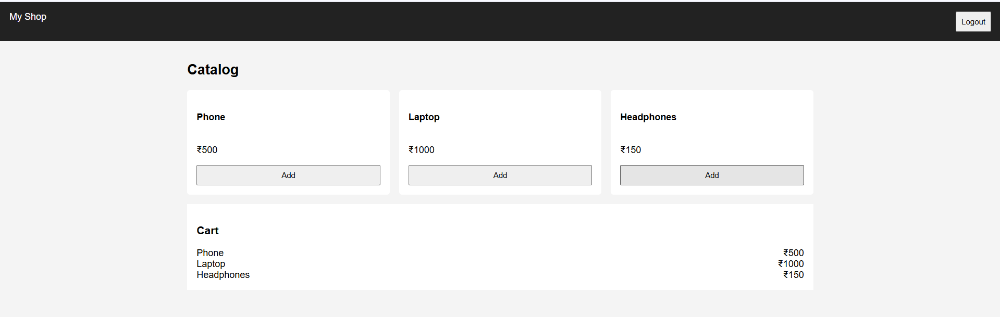

# Week 3 - Dynamic Web Project

## Project Description
This project is a dynamic web application developed using Eclipse.

## Technologies Used
- Java
- Servlets
- HTML
- Eclipse IDE

## How to Run
1. Import project into Eclipse
2. Run on server (Tomcat)
3. Open browser and access the application

## Output Screenshot

